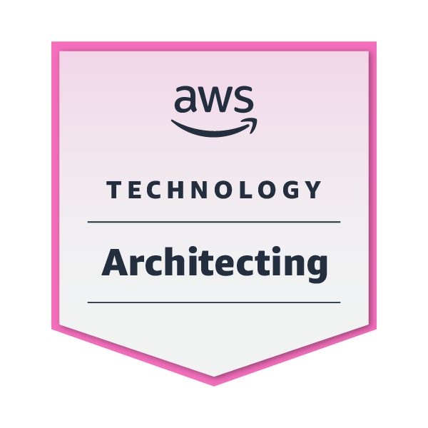
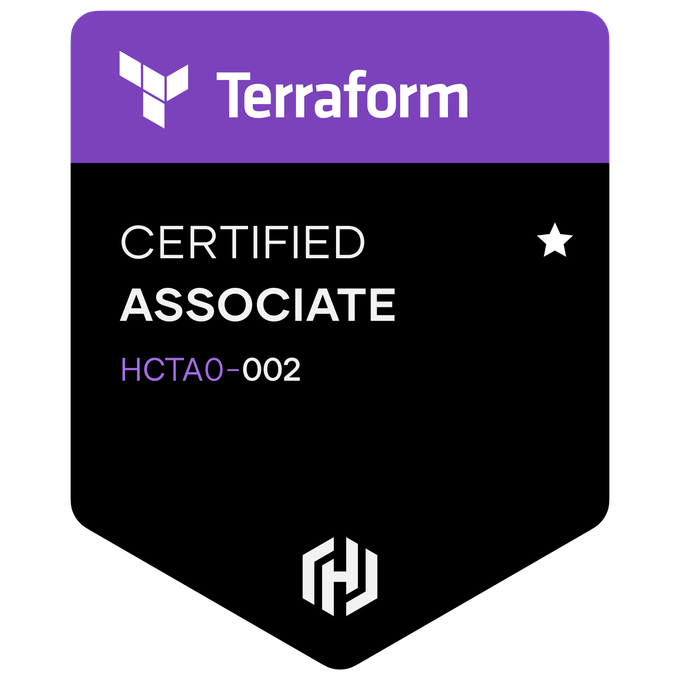

+++
title = "Certifications"
description = "Explore my professional certifications and qualifications in cloud computing, devops, and software engineering. Learn more about my expertise in AWS, Terraform, Python, and more, as well as my achievements and credentials in the tech industry."
heroStyle = "background"
showDate = false
showAuthor = false
showWordCount = false
showReadingTime = false
showTableOfContents = false
sharingLinks = [""]
+++

|                                                 |                                         |                                                   |
| ----------------------------------------------- | --------------------------------------- | ------------------------------------------------- |
|                          |              |                |
|                    |        |                     |
|              |  |        |
|            |          |  |
|  |         |                      |

[Credly Profile](https://www.credly.com/users/yaseenyounus)
